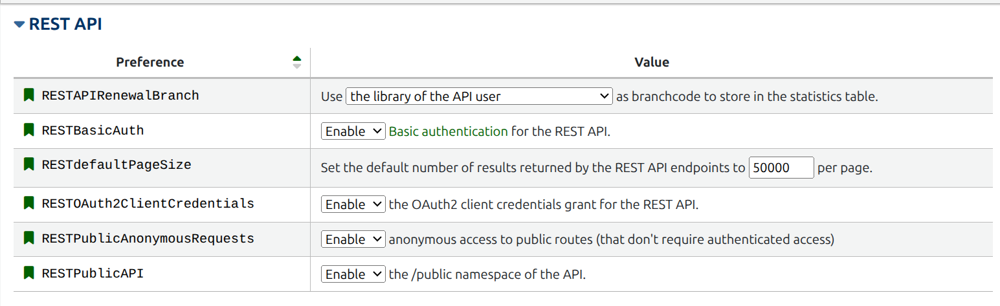

# Installation

## Package installation

### Using [pip](https://pip.pypa.io/en/stable/getting-started/)

Generate the virtual environment on your project folder:

```bash
# Generate local python binaries in folder
python3 -m venv pyreslib-env
```

Activate virtual environment in order to invoke the package:

```bash
# activate the environment for this terminal
source pyreslib-env/bin/activate
```

```bash
pip install pyreslib
```

### Using [uv](https://docs.astral.sh/uv)

Do not forget to include the `pyproject.toml` file in your project directory. You can find a copy of the file in our [GitHub repository](https://github.com/NicholasCorniaOrpheus/py-resounding-libraries/blob/main/pyproject.toml).

Generate the virtual environment on your project folder:

```bash
# Generate local python binaries in folder
uv venv pyreslib-env
```

Activate virtual environment in order to invoke the package:

```bash
# activate the environment for this terminal
source pyreslib-env/bin/activate
```

```bash
uv add pyreslib
```

### Python for Windows and Mac users

Have a look at this detailed [documentation](https://realpython.com/installing-python/).


## Data structure


## MARC and JSON records

The package suppose a specific folder structure for credentials, mappings files and data paths. You can easily clone our [GitHub repository](https://github.com/NicholasCorniaOrpheus/py-resounding-libraries) and copy the relevant directories to your projec folder.

```bash
git clone https://github.com/NicholasCorniaOrpheus/py-resounding-libraries.git
```

Create a `data` folder with subfolders `koha_auth` and `koha_biblio`. For both authorities and biblionumbers, make subdirectories `marc` and `json`.

```project
your_project
├── data
│   ├── credentials
│   │   └── credentials.json
│   ├── koha_auth
│   │   ├── csv
│   │   ├── json
│   │   └── marc
│   ├── koha_biblio
│   │   ├── csv
│   │   ├── json
│   │   └── marc
│   ├── kraken
│   │   ├── models
│   │   │   └── catmus-large
│   │   │       ├── catmus-print-fondue-large.mlmodel
│   │   │       └── metadata.json
│   │   └── transcriptions
│   ├── mappings
│   │   ├── abbreviations
│   │   │   ├── item_types.json
│   │   │   ├── languages.json
│   │   │   ├── musical_instruments.json
│   │   │   └── relationships.json
│   │   ├── bibtex
│   │   │   ├── country_codes.csv
│   │   │   ├── koha_entry_types.json
│   │   │   └── role_codes.csv
│   │   ├── external_sources
│   │   │   └── external_sources.json
│   │   ├── google
│   │   │   └── google_books-koha_mapping.csv
│   │   ├── koha
│   │   │   ├── authority_list.csv
│   │   │   └── biblio_list.csv
│   │   ├── lod
│   │   │   ├── external_identifiers.json
│   │   │   ├── koha-rdf_mapping-auth.csv
│   │   │   ├── koha-rdf_mapping-biblio.csv
│   │   │   └── rdf_namespaces.json
│   │   ├── omekas
│   │   │   ├── biblionumber_barcode.csv
│   │   │   ├── koha-omekas_mapping - auth.csv
│   │   │   ├── koha-omekas_mapping - biblio.csv
│   │   │   ├── koha-omekas_mapping - locations.csv
│   │   │   ├── koha-omekas_mapping - media.csv
│   │   │   ├── koha-omekas_mapping - projects.csv
│   │   │   ├── koha-omekas_mapping - researchers.csv
│   │   │   └── koha-omekas_mapping - research_groups.csv
│   │   └── wikidata
│   │       ├── authority_wd_list.csv
│   │       ├── wd_authority_list.csv
│   │       └── wikidata-koha-properties.csv
│   ├── rdf
│   │   ├── auth
│   │   └── biblio
│   └── wikidata
│       ├── backup_auth
│       ├── changed_auth
│       ├── qid_log
│       └── statistics


```

### Credentials

In your `data` folder you should create a `credentials` directory to store all your sensible data. All credentials are stored in `credentials.json` file. Copy the [credential template](https://github.com/NicholasCorniaOrpheus/py-resounding-libraries/blob/main/credentials/credentials.json) from our GitHub repository.


## Mappings

Create a `data/mappings` folder in order to store all mappings between your Koha instance and other external services, such as Wikidata, Google Books, Omeka S and Resource Space. You can copy the [mapping templates](https://github.com/NicholasCorniaOrpheus/py-resounding-libraries/tree/main/data/mappings) from our GitHub repository and modify them accordingly.


## Koha Setup

- Generate Client ID and Secret Key for your Koha admin user according to the [official documentation](https://koha-community.org/manual/latest/en/html/webservices.html#api-key-management-interface-for-patrons).
- Create reports according to the [Reports](reports.md) section.
- Allow [REST API preferences](https://koha-community.org/manual/latest/en/html/webservicespreferences.html#rest-api) from Koha Administration panel accessible via `https://{your_koha_staff_url}/cgi-bin/koha/admin/preferences.pl?tab=web_services#web_services_REST_API`. 

