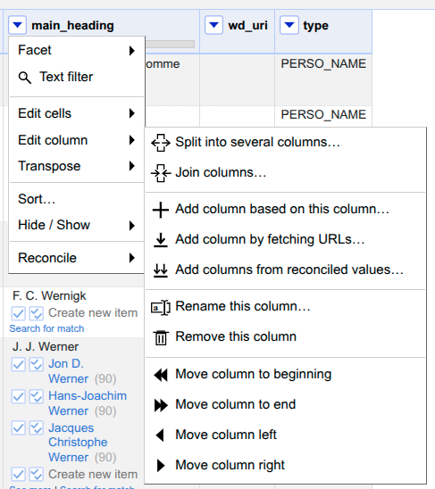
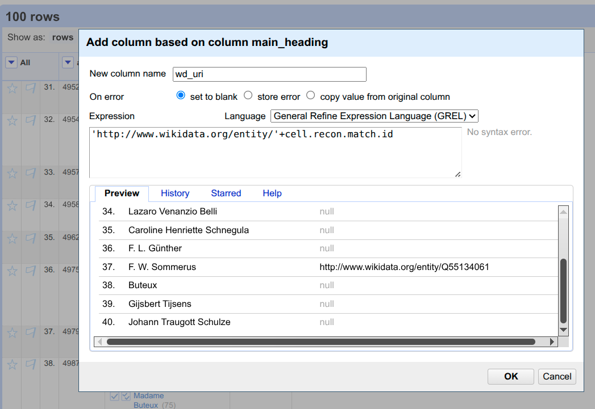

# Tutorials

## Getting authorized sessions

In order to get authorization from Koha, Transkribus and Wikidata services, we need to store the API credentials of each platform. Copy the [sample file](https://github.com/NicholasCorniaOrpheus/py-resounding-libraries/blob/main/data/credentials/credentials.json) to the `data/credentials` directory of your project and adjust the credential values according to your passwords and keys.

In order to authenticate, you need to include these lines to your Python code:

```python
from pyreslib import wikidata, koha, transkribus, utilities

### CREDENTIALS

credentials = utilities.json2dict("./data/credentials/credentials.json")

koha_base_url = credentials["koha"]["koha_api_url"]

# Generating OAuth2 credentials for Koha API
koha_session = koha.koha_session(
    client_id=credentials["koha"]["oauth_credentials"]["client_id"],
    client_secret=credentials["koha"]["oauth_credentials"]["client_secret"],
    user_agent=credentials["koha"]["oauth_credentials"]["user_agent"],
    base_url=koha_base_url,
)

# Generating session for Transkribus API
transkribus_session = transkribus.api_login(
    user=credentials["transkribus"]["user"],
    password=credentials["transkribus"]["password"],
)

# Generating Wikidata session for Wikibase Integrator
wb = wikidata.wikibase_integrator_session_basic(
    username=credentials["wikidata"]["username"],
    password=credentials["wikidata"]["password"],
)
```

## CSV import/export to MARC

This tutorial shows how to convert a MARC file into CSV and TXT.

```python
csv_filepath = "./data/koha_biblio/csv/records.csv"
marc_filepath = "./data/koha_biblio/marc/records.mrc"

marc.marc2csv(marc_filepath, csv_filepath)
records = marc.csv2marc(csv_filepath, marc_filepath)

marc.marc2txt(marc_filepath)
```


## Reconciling authorities via OpenRefine and PyResLib

In this short tutorial, we are going to:

1. Extract from our Koha catalogue a list of authorities without Wikidata QID via Report.
2. Reconcile the authorities to Wikidata QIDs using OpenRefine via the authorities' main headings.
3. Ingest the Wikidata URIs back to the catalogue via PyResLib Koha API functions.

### Step 1

Create a new Koha Report with the following SQL code:
```sql
SELECT authid, concat(
ExtractValue(`marcxml`,'//datafield[@tag="100"]/subfield[@code="a"]'), -- PERSO_NAME
ExtractValue(`marcxml`,'//datafield[@tag="110"]/subfield[@code="a"]'), -- CORPO_NAME
ExtractValue(`marcxml`,'//datafield[@tag="111"]/subfield[@code="a"]'), -- MEETI_NAME
ExtractValue(`marcxml`,'//datafield[@tag="130"]/subfield[@code="a"]'), -- UNIF_TITLE
ExtractValue(`marcxml`,'//datafield[@tag="148"]/subfield[@code="a"]'), -- CHRON_TERM
ExtractValue(`marcxml`,'//datafield[@tag="150"]/subfield[@code="a"]'), -- TOPIC_TERM
ExtractValue(`marcxml`,'//datafield[@tag="151"]/subfield[@code="a"]'), -- GEOGR_NAME
ExtractValue(`marcxml`,'//datafield[@tag="155"]/subfield[@code="a"]')  -- GENRE/FORM
) AS main_heading,
ExtractValue(`marcxml`, '//datafield[@tag="024"]/subfield[@code="1"]') AS wd_uri,
ExtractValue(`marcxml`, '//datafield[@tag="942"]/subfield[@code="a"]') AS type
FROM `auth_header`
WHERE ExtractValue(`marcxml`, '//datafield[@tag="024"]/subfield[@code="1"]') IS NULL
OR ExtractValue(`marcxml`, '//datafield[@tag="024"]/subfield[@code="1"]') = '' 
AND ExtractValue(`marcxml`, '//datafield[@tag="942"]/subfield[@code="a"]') LIKE CONCAT ( '%', <<Authority Type code>>, '%' )
ORDER BY authid ASC

LIMIT 100 -- Adjust the limit value based on your needs and reconciliation time.
```

Select the authority type, such as `PERSO_NAME` or `GEOGR_TERM`. After running the report via the Staff Interface, save the result as CSV file.

### Step 2

Import your CSV file as new project in your [OpenRefine](https://openrefine.org/) application. We are using version 3.10.1 for this tutorial.

You can split the main_heading column based on a separator via `Edit Column/Split into separate columns...` command. Afterwards, you can recombine the splitted columns via `Edit Column/Join columns...`. This procedure is useful in order to turn Personal Names in the form `Surname, Name` into `Name Surname` for Wikidata matching.



Once you have reconciled a reasonable number of authorities, you can create a new column via `Edit column/Add column based on this column...` that will parse the Wikidata Concept URI from the reconciliation service by using the GREL formula

```
'http://www.wikidata.org/entity/'+cell.recon.match.id
```



### Step 3

Export the OpenRefine project as CSV (Comma separated values) and rename it as `add_qids_to_authorities.csv` in the `data/wikidata` default folder.

Create a Python script in your project folder called `ingest_QIDs_from_CSV.py`
```python
from pyreslib import wikidata, koha, utilities

### CREDENTIALS

# ... see first tutorial for credential code.

print("Adding QIDs from CSV file")
wikidata.add_qids_to_authorities(koha_session=koha_session, koha_base_url=koha_base_url)

```

Then from terminal in the script's folder run the command

```bash
python3 ingest_QIDs_from_CSV.py
```

Your authorities should be automatically updated.

## Wikidata enhancement of authorities

Don't forget to set up the `wikidata-koha-properties.csv` mapping. You can modify the sample CSV according to your preferences and store it in `data/mappings/wikidata` folder.

```python
from pyreslib import koha,utilities,wikidata
import os 

print(f"Importing from latest MARC export...")
koha_auth_marc_dir = os.path.join("data", "koha_auth", "marc")
auth_dict = koha.import_koha_authorities_from_marc(
    marc_filepath=utilities.get_latest_file(koha_auth_marc_dir)
)

print(f"Importing authorities dictionary...")
auth_dict = utilities.json2dict("./data/koha_auth/json/auth_dict-YYYY-MM-DD.json")

test_auth_id = 4000

# Enhance authorities between ID 4000 and 4500 that are not Geographical Terms.
backup_authorities, changed_authorities = wikidata.enhance_authorities_via_wikidata(
    auth_dict,
    wb,
    auth_id_range={"min": test_auth_id, "max": test_auth_id + 500},
    exclude_types=["GEOGR_TERM"]
)

# Generate statistics from enhancing process
wikidata.generate_statistics_authorities_wikidata_enhancement(changed_authorities)


print("Have a look at the changed_auth file.")
input("Press Enter to submit changes to Koha via API...")

print("Updating enhanched files to Koha")
wikidata.update_enhanced_authorities(
    koha_session=koha_session,
    koha_base_url=koha_base_url,
    changed_auth_filepath=utilities.get_latest_file(
        os.path.join("data", "wikidata", "changed_auth")
    ),
)
```


## Export bibliographic records and authorities as RDF

In this tutorial we are going to export a list of biblio and authority IDs in RDF Turtle format.

```python
from pyreslib import koha, utilities, rdf

### CREDENTIALS

# ... see first tutorial for credential code.

## RDF

biblio_ids_list = [1,32,432]

auth_ids_list=[i for i in range(1,101)] # first 100 authorities

rdf.biblio_records_to_rdf(
     biblio_ids=biblio_ids_list,
     session=koha_session,
     base_url=koha_base_url,
    koha_namespace="oikoha",
)

rdf.auth_records_to_rdf(
     auth_ids=auth_ids_list,
     session=koha_session,
     base_url=koha_base_url,
     koha_namespace="oikoha",
     serialization_format="turtle",
     explicit_abbreviations=False,
 )
```